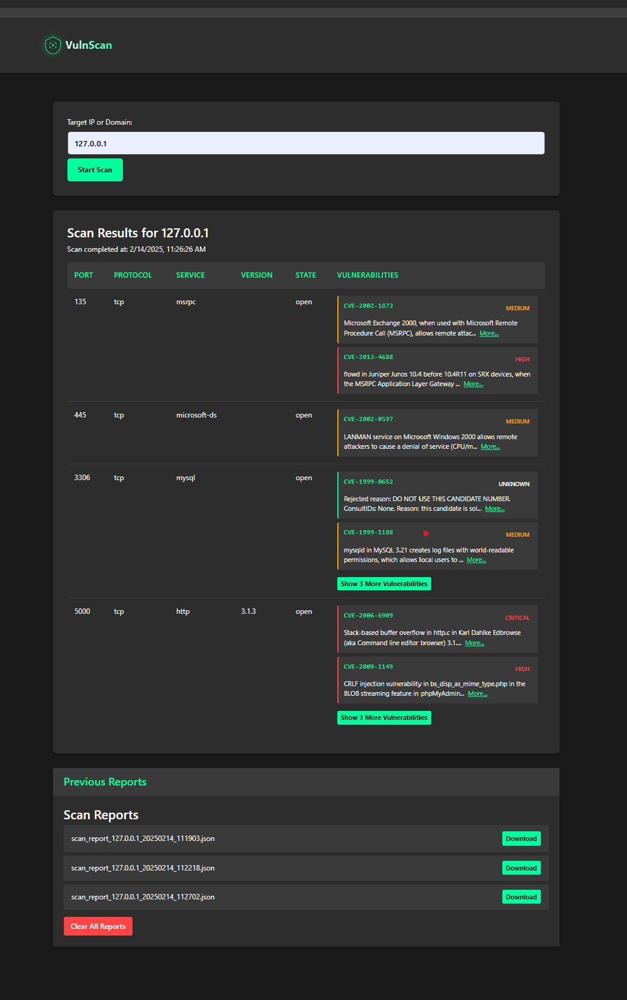

# VulnScan - Network Vulnerability Scanner

A modern web-based vulnerability scanner that combines Nmap port scanning with the National Vulnerability Database (NVD) to identify potential security vulnerabilities in network services.

## Features

- Port scanning with service detection using Nmap
- Real-time vulnerability assessment using NVD database
- Color-coded severity indicators (Critical, High, Medium, Low)
- Interactive vulnerability details with expandable descriptions
- Clean, modern dark theme interface
- Scan report history with downloadable results

## Screenshot



The interface shows:
- Port scanning results with service detection
- Vulnerability assessment with severity indicators
- Truncated descriptions with "More..." expansion
- Additional vulnerabilities accessible via "Show More"
- Previous scan reports with download options

## More Screenshots

View additional screenshots in the [screenshots directory](screenshots/):
- [Detailed Vulnerability View](screenshots/vulnerability_details.png) - Modal showing full vulnerability details
- [Full Vulnerability List](screenshots/full_vulnerability_list.png) - Expanded view of all vulnerabilities for a port

## Demo Video

Watch a quick demo of VulnScan in action:

https://www.loom.com/share/8204a02077d84e448c0ee87be12e6d9c?sid=242eeaf7-714b-4296-875f-42d9079e360c

In this demo, I show:
- Setting up and running the application
- Performing a vulnerability scan
- Analyzing scan results and severity levels
- Exploring detailed vulnerability information
- Managing scan reports and history

## Prerequisites

- Python 3.8+
- Nmap ([Download here](https://nmap.org/download.html))
- Modern web browser

## Installation

1. Clone the repository:
```bash
git clone https://github.com/DhruvKapadia00/VulnScan.git
cd VulnScan
```

2. Create a virtual environment:
```bash
python -m venv venv
source venv/bin/activate  # On Windows: venv\Scripts\activate
```

3. Install dependencies:
```bash
pip install -r requirements.txt
```

4. Install Nmap:
- Windows: Download and install from [nmap.org](https://nmap.org/download.html)
- Linux: `sudo apt-get install nmap`
- macOS: `brew install nmap`

## Usage

1. Start the application:
```bash
python app.py
```

2. Open your browser and navigate to `http://localhost:5000`

3. Enter an IP address or domain to scan

4. View results and download reports

## ⚠️ Important Security Notice

Before using this vulnerability scanner, please be aware:

- Only scan systems that you own or have explicit permission to test
- Unauthorized scanning may be illegal and could result in legal consequences
- Some networks and ISPs may block scanning activities
- Consider using test environments for learning and development

## Contributing

Contributions are welcome! Please feel free to submit a Pull Request.

## License

This project is licensed under the MIT License - see the [LICENSE](LICENSE) file for details.

## Acknowledgments

- [Nmap](https://nmap.org/) for the powerful network scanning capabilities
- [National Vulnerability Database](https://nvd.nist.gov/) for vulnerability data
- [Flask](https://flask.palletsprojects.com/) for the web framework

## Author

Dhruv Kapadia - [GitHub Profile](https://github.com/DhruvKapadia00)
